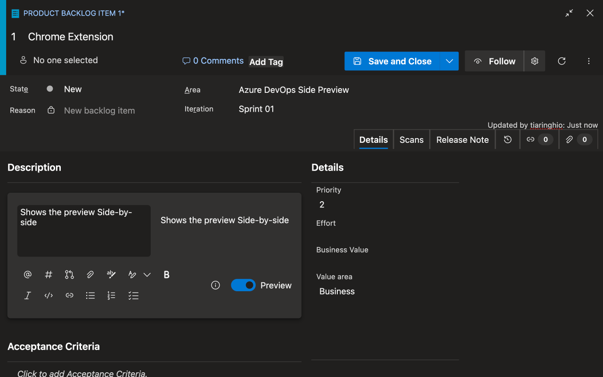
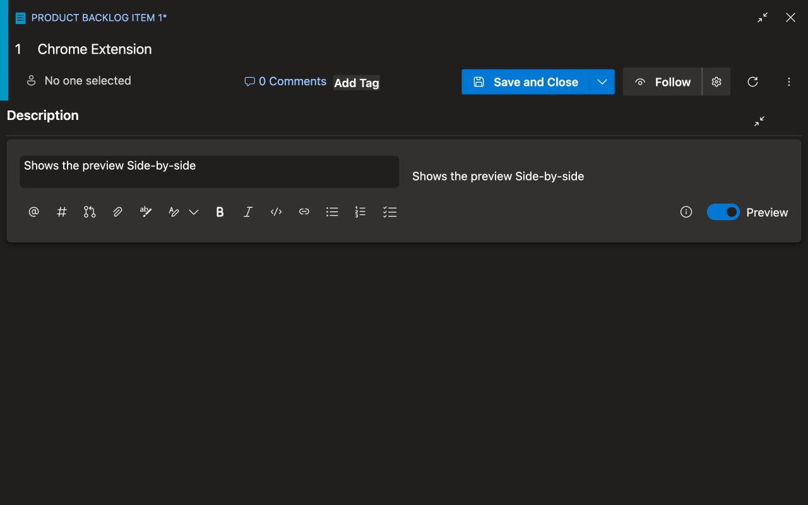
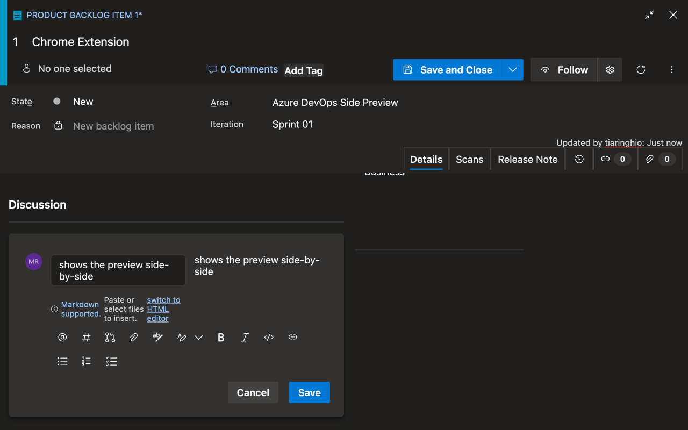

# Azure DevOps Side Preview

Azure DevOps Side Preview improves the Markdown editor in Work Items and Comments by placing the preview on the right, side-by-side with the editor (50/50). The toolbar stays on a full-width row under the editor, keeping all controls accessible and aligned. It works on `dev.azure.com` and `visualstudio.com` and does not collect any data.

## Features
- Side-by-side layout (50/50) for editor and preview
- Toolbar on a full-width row under the editor
- Works for Work Items and Comments
- No data collection

## Screenshots

## Supported Sites
- `https://dev.azure.com/*`
- `https://*.visualstudio.com/*`

## Install (Developer Mode)
1. Open Chrome/Edge and go to `chrome://extensions`.
2. Enable **Developer mode**.
3. Click **Load unpacked** and select this folder.

## Packaging for Chrome Web Store
Include only these files in the ZIP:
- `manifest.json`
- `content.js`
- `styles.css`
- `icons/*` (PNG: 16, 32, 48, 128)

## License
MIT License. See [LICENSE](LICENSE).

## Privacy Policy
See [PRIVACY_POLICY.md](PRIVACY_POLICY.md).
